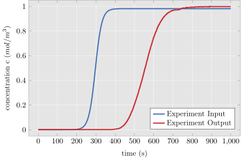

# Catalyst.jl

The research project of the [Chair of Mechanics - Continuum Mechanics Ruhr-University Bochum](http://www.lkm.rub.de/index.html.en) in collaboration with [Hirshikesh Joshi from the Max Planck Institute for Coal Research](https://www.kofo.mpg.de/en/research/heterogeneous-catalysis)

This package gathers all developed finite element discretizations for a suitable description of the underlying mass transport experiment explained in [Koh et al.[1998]](https://pubs.acs.org/doi/10.1021/ie970337i). 
Besides solving a discretized problem with given experimental input, it is also able to calibrate the instantiated model against experiment data by means of an optimization.
For the optimization the python package [cma from Nikolaus Hansen](https://github.com/CMA-ES/pycma) is used. 

The experiment data that we try to described looks for instance like this:

where *Experiment Input* serves as the dynamic Dirichlet boundary condition for the model.
Here *Experiment Output* can optionally be used as a target function for the model and thus, is used for calibration as the reference curve.

The continuous model in this package relies heavily on continuum mechanical principles and so, assumes that the continuum assumption is valid.
In this package the discretized partial differential equation is the advection-diffusion-reaction (ADR) equation, which finds versatile usage in fluid mechanics. 
It describes the transport of a scalar quantity (mass, concentration, ..) in terms of two mechanisms:

 - advection by a given velocity field $\overline{\mathbf{w}}$ 
 - diffusion by a given constitutive equation, e.g. Fick's law and given Diffusion tensor $\overline{\mathbf{D}}$

 Besides the two mentioned mechanisms the scalar transport can be *created* or *destroyed* by a suitable sink/source term. 
 In the scope of the ADR equation this source/sink term is called reaction term $\overline{R}$ and serves within this paper as the scale bridging operator. 

The strong form of the ADR is given by

$$\frac{\partial \overline{c}}{\partial t} = \nabla \cdot (\overline{\mathbf{D}} \nabla \overline{c}) - \nabla (\overline{\mathbf{w}}\ \overline{c})+\overline{R}$$

and discretized by finite elements in the weak form by integrating the strong form over the computational domain $\overline{\Omega}$ and multiplying a test function $\overline{v}$ 

$$\int_{\overline{\Omega}}\frac{\partial\overline{c}}{\partial t}\overline{v} \text{ d}V +\int_{\overline{\Omega}} {\mathbf{w}} \cdot  \nabla \overline{c}\ \overline{v}\text{ d}V + \int_{\overline{\Omega}} \nabla \overline{c}^{\text{T}} \cdot \overline{\mathbf{D}}\nabla \overline{v}\text{ d}V  = \int_{\overline{\Omega}}R\ \overline{v}\text{ d}V$$

This documentation page is the starting point to understand the underlying algorithms of the package.

The documentation is mainly structured in three topics: macroscopic, microscopic and utils code. It is suggested to start with the macroscopic section, then reading the microscopic part and optionally end with the utils section.

