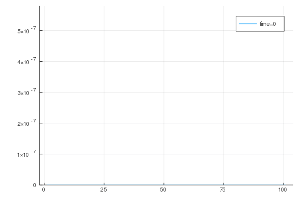
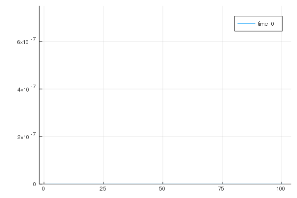
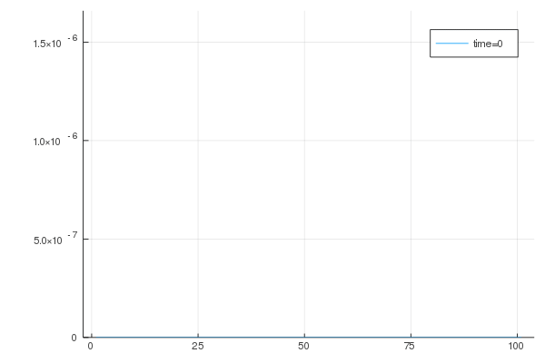
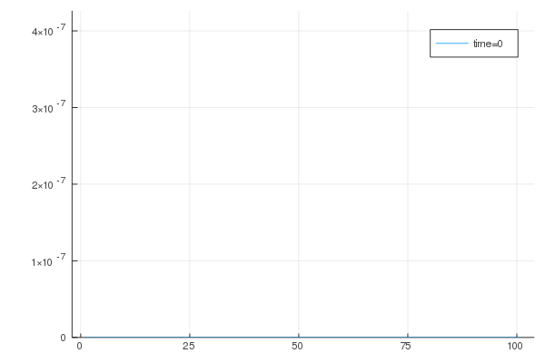
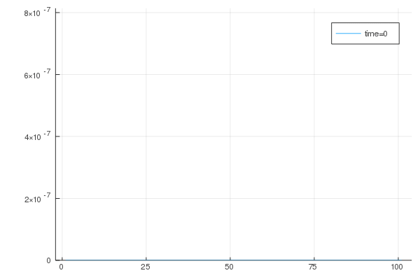
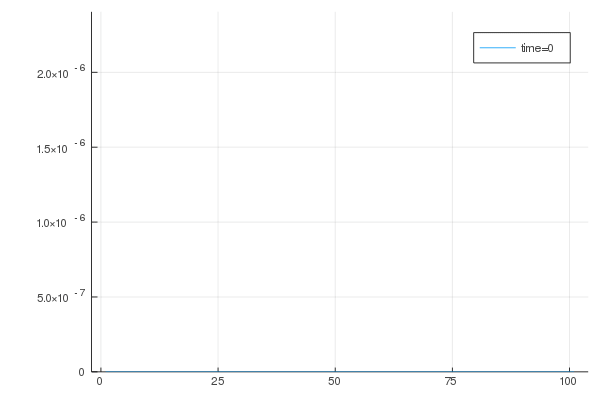
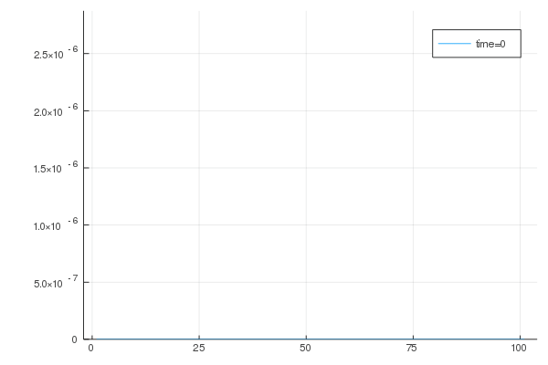

All simulations are carried out with the previous optimized set of parameters, i.e.
$k_{\Gamma}$ and $k$ are taken from previous calibrations, except for the last subsection,
where it is tried to obtain a different qualitative response from the absorption term $\overline{R}$.
There, an accelerated absorption wave is tried.

## Study of parameter $k_n$ influence
In this study we fix $Q=1$.
### Macroscopic point of view

Here, we take a look at the homogenized absorption term, i.e.

$$\overline{R}=\int_{\partial\Omega} (\mathbf{D} \nabla c) \cdot \mathbf{n} \ dA$$

 $k_n=0.1$                |  $k_n=1$
:-------------------------:|:-------------------------:
  |  
   $k_n=10$                |  $k_n=20$
  |  

### Microscopic point of view
The gif below illustrates the evolution of the catalyst at the 50th element (middle of domain)
in the first gauss point for the same parameter variations. From left to right $k_n=(20,10,1,0.1)$

## Study of parameter $Q$ influence
To study the influence of $Q$, we first fix $k_n$ to $1$.
### Microscopic point of view

We observe in the same fashion the variation of $Q$

 $Q=0.1$                |  $Q=1$
:-------------------------:|:-------------------------:
  |  
   $Q=10$                |  $Q=20$
  |  

### Microscopic point of view

Finally, we also take a closer look at the first gauss point of the 50th element, when parameter
$Q$ is varied. Again, it is in descending order, so $Q=(20,10,1,0.1)$

## Full control for specific set of parameters
Upon till now, we were not able to control the qualitative behavior of the absorption term.
However, for a variation study of $Q$ with fixed $k_n=10$ and an accelerated absorption wave, i.e. setting $k_{\Gamma}=1$ instead of $25.558$
we obtain a slightly different behavior.

 $Q=0.1$                |  $Q=1$
:-------------------------:|:-------------------------:
  |  
   $Q=10$                |  $Q=20$
  |  

## Conclusion

- we have full control over the speed of the wave by already introduced parameters $k_{\Gamma}$ and $k$
- we can influence the peak of the bell curve by $k_n$
- we can "desymmetrize" the bell curve with a higher value of $Q$
- we can obtain completely different behavior on micro scale for a specific set of parameters

